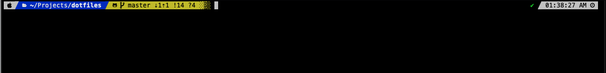

## Gobi's dotfiles         [](https://travis-ci.org/gobinathm/dotfiles)

:wrench: .dotfiles — techies defaults for macOS

## Installation

**Warning:** If you want to give these dotfiles a try, clone the repo, review the code, and remove things you don’t want or need. Don’t blindly use my settings. Use at your own risk!

### Basic Oh My Zsh Installation
Oh My Zsh is installed by running one of the following commands in your terminal.

```bash
sh -c "$(wget https://raw.githubusercontent.com/robbyrussell/oh-my-zsh/master/tools/install.sh -O -)"
```

### Install powerlevel9k theme for Oh My Zsh
To install this theme for use in Oh-My-Zsh, clone this repository into your OMZ custom/themes directory.

```bash
$ git clone https://github.com/bhilburn/powerlevel9k.git ~/.oh-my-zsh/custom/themes/powerlevel9k
```

### Install Powerline Fonts
You can find the [installation instructions for Powerline Fonts here](https://powerline.readthedocs.org/en/latest/installation/linux.html#fonts-installation). You can also find the raw font files [in this Github repository](https://github.com/powerline/fonts) if you want to manually install them for your OS. Once the font installation is successfuly, ensure you have select any of the powerline font as your terminal font.

####View of the Terminal


### Fresh Mac Setup (Outdated)

```bash
git clone https://github.com/gobinathm/dotfiles.git && cd dotfiles && source install.sh
```

### Git-free install (Outdated)

To install these dotfiles without Git:

```bash
cd; curl -#L https://github.com/gobinathm/dotfiles/tarball/master | tar -xzv --strip-components 1 --exclude={README.md,bootstrap.sh,.osx,LICENSE-MIT.txt}
```

To update later on, just run that command again.

## Issues / Suggestions ?

Log any of them in the issue queue
[Issue Queue](https://github.com/gobinathm/dotfiles/issues)!

## Author

[Gobinath Mallaiyan](http://twitter.com/gobinathm/) |


## Inspiration and Reference …

* [Mathias Bynens](https://github.com/mathiasbynens/dotfiles)
* [@ptb](https://github.com/ptb/Complete-macOS-Setup/)
* [Yossef Mendelssohn](https://github.com/ymendel/dotfiles/)
